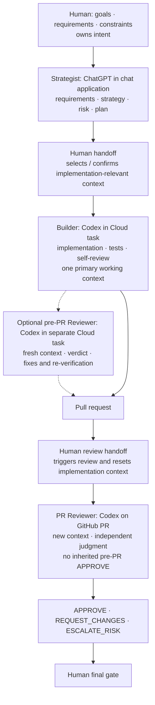

# CNAD workflow

CNAD optimizes for deliberate context design before implementation, useful context continuity while building, and deliberate context boundaries for independent judgment.

> **Design the context. Preserve it while building. Break it when judging.**

## Roles

CNAD separates three responsibilities. They are roles, not necessarily separate tools or agents.

- **Strategist** — helps turn human intent into implementation-ready working context.
- **Builder** — owns implementation and keeps useful implementation context while working.
- **Reviewer** — independently judges the resulting change across the review boundary.
- **Human** — owns intent and any approval required by the risk level.

> The Strategist advises. The Human owns intent.

> The Builder owns implementation, not intent.

> The Reviewer judges the result, not the implementation story.

## Default flow

1. The Human supplies goals, requirements, and constraints to the Strategist and retains ownership of intent. The Strategist clarifies them, repository rules, acceptance criteria, important unknowns, and likely impact to the depth justified by risk and ambiguity.
2. Route the task as Low, Medium, or High risk using the strongest relevant signal.
3. Produce an implementation brief when it improves implementation. Do not create one merely because the template exists.
4. The Builder implements with one primary working context when continuity remains useful.
5. Run relevant automated checks and self-review.
6. Perform an independent review of the completed change for every code change. In a GitHub Pull Request workflow, create the PR before this review and reset review context to judge the completed PR diff.
7. Apply additional verification and human approval when the risk requires it.

During implementation or before PR creation, the Builder may also use a separate Reviewer with fresh context for an optional **pre-PR quality gate**. Apply Blocking / in-scope fixes and re-run relevant verification before proceeding to commit, push, and PR creation; follow existing scope discipline and risk escalation rules.

Pre-PR Independent Review and PR Independent Review are separate review boundaries. A pre-PR `APPROVE` does not complete or replace the Independent Review after PR creation. Reset context for that review even when pre-PR review has already run. If PR review requires changes, the Builder fixes and verifies them within scope, then returns the updated PR for re-review before the Human final gate. See `review.md` for review evidence, verdicts, and completion signals. Without GitHub PRs, review the completed change through the same independent judgment boundary and Output contract.

For Low-risk work, strategic framing may be lightweight and performed in the same working context as implementation. Medium- and High-risk work benefit more strongly from an explicit Strategist step. High-risk work should make the proposed intent, boundaries, and verification expectations visible to the Human before substantial implementation begins.

> Preserve context during implementation. Reset context for independent judgment.

> Review broadly. Change narrowly.

## Project-specific role and boundary mapping

A project may declare its mapping in the project-owned `.cnad/project.md`, alongside repository-specific constraints. Use ordinary Markdown; there is no required schema or CLI parser. The mapping describes how people and agents apply CNAD, not executable routing: it does not launch agents, switch surfaces, or enforce gates automatically.

Keep these concepts distinct:

- **Role** — responsibility: Human, Strategist, Builder, or Reviewer.
- **Surface** — where the work or handoff happens, such as a chat application, cloud task, local terminal, or pull request.
- **Agent / Product** — the person or agent fulfilling a role, optionally naming a product or model. A product is not a role or a context identity.
- **Boundary** — the transfer of intent or selected evidence, or a deliberate reset of working context for independent judgment.
- **Gate** — the condition for proceeding and who decides, including required Human approval. A Reviewer verdict is not Human merge approval.

Start with **Human → Strategist** and include the Human final gate. Identify what crosses each boundary, who controls the handoff, and which review contexts must be fresh. The same product can fulfill several roles, but Builder, optional pre-PR Reviewer, and completed-change Reviewer must not share a continuing implementation/review conversation. Low-risk strategic framing may still share the Builder's context as described above; the initial intent boundary does not mandate another agent or session.

### Absent or partial mapping

- If `.cnad/project.md` or its mapping is absent, continue the existing CNAD default flow and risk routing. No product, surface, or extra orchestration is required.
- A partial mapping declares only what it explicitly names. Omitted roles or boundaries retain their CNAD responsibilities and review/approval requirements; omitted products and surfaces remain unspecified, not inferred from this example. Existing project guidance remains valid and need not be migrated.
- A project mapping supplements the method. It cannot waive completed-change Independent Review, context resets, risk-required Human approval, or Human ownership of intent. Resolve conflicting guidance with the Human before crossing the affected boundary; do not silently weaken a gate. Clarify a missing operational assignment only when it prevents the next handoff.
- `cnad init` preserves an existing `.cnad/project.md`. `cnad update` and `cnad update --check` do not modify or recreate it. Maintainers add or revise mappings themselves; this file is outside the managed-file hash manifest.

### Copy-safe example for `.cnad/project.md`

Copy and adapt this section into the project's existing guidance. Product names illustrate one deployment; replace them with the project's actual people, agents, and surfaces. The five rows describe handoffs, not a mandatory number of agents or sessions.

```markdown
## Role, surface, agent, boundary, and gate mapping

| Handoff | Surface | Agent / Product | Boundary and evidence | Gate / decision owner |
| --- | --- | --- | --- | --- |
| Human → Strategist | Chat application | Human → ChatGPT (Strategist) | Human supplies goals, requirements, and constraints. Strategist helps clarify requirements, risk, and implementation direction; Human retains intent ownership. | Human owns intent; make risk-required approval visible before substantial implementation. |
| Strategist → Builder | Chat application → Cloud task | ChatGPT (Strategist) → Codex (Builder) | Human selects and hands off implementation-relevant context: goal, constraints, acceptance criteria, risk, and verification expectations. Builder implements, tests, and self-reviews. | Human controls the handoff; Builder works within the authorized scope. |
| Builder → pre-PR Reviewer (optional) | Cloud task → separate Cloud task | Codex (Builder) → Codex (Reviewer, fresh context) | Start a new independent review context with the completed diff and minimum review evidence, without the implementation conversation. | Reviewer returns a verdict. Builder fixes Blocking / in-scope findings and re-verifies before PR creation; escalate risk when needed. This gate may be omitted. |
| Builder → PR Reviewer | Cloud task → GitHub PR | Codex (Builder) → Codex (Reviewer, new PR review context) | Create the PR, then reset context again. Judge the PR diff and minimum useful evidence; inherit neither Builder context nor the pre-PR review conversation or APPROVE. | Completed-PR Independent Review is required even after pre-PR APPROVE. Builder fixes and verifies Blocking / in-scope findings, then obtains re-review. |
| Reviewer → Human | GitHub PR → Human decision | Codex (Reviewer) → Human | Hand off the recorded verdict, findings, risk, and verification evidence. | Human makes the final approval / merge decision, including any risk-required approval. |

Follow `.cnad/method/review.md` for review evidence and verdicts and
`.cnad/method/risk-routing.md` for risk and escalation. This mapping is
declarative; it does not automate handoffs or grant agents approval authority.
```

## Concrete tool mapping example

The following is one practical way to run the CNAD workflow with current tools. It is an example, not a required product configuration: **Strategist, Builder, and Reviewer name responsibilities and context boundaries, not products.**



The Human controls both boundaries: what useful strategic context reaches the Builder, and where the implementation conversation is reset before review. The Builder keeps that selected context while implementing. The Reviewer receives the minimum useful review evidence, but does not inherit the Builder's conversation as its working context.

Builder and Reviewer can therefore both use Codex. Independent review does not require a different AI model; it requires **fresh context and independent judgment**. The Human still owns intent and the final gate.

The optional pre-PR quality gate may occur before the Pull Request in this example; the PR review boundary still follows PR creation.

## Copy-safe Human handoff

When the Builder returns an artifact intended for the Human to copy into another tool, agent, or system, copy/paste integrity is part of the handoff contract. This applies to artifacts such as Markdown, SQL, YAML, JSON, prompts, and Issue or PR bodies—not to ordinary conversational explanations.

Treat explicit requests such as “ready to paste” or “summarize in Markdown” as copy-safe handoffs. Do the same when wording such as “put it together” clearly implies reuse elsewhere; do not ask the Human to confirm the format when the context already establishes that intent.

- Return the artifact as one continuous copy-safe block when practical; do not needlessly split it across Markdown blocks.
- Keep explanations, progress reports, and side comments outside the artifact.
- Choose a wrapper that preserves the artifact's structure after copying. For example, when a Markdown artifact contains fenced code blocks, use an outer fence longer than any fence inside it.
- Before handoff, verify that delimiters and fences match and that copying the complete artifact preserves its intended structure.

> **If the Human carries the artifact, preserve it across the handoff.**

## Safe failure and escalation

CNAD favors useful autonomy over constant interruption. The Builder should investigate, verify, and retry within the authorized task boundary when reasonable rather than escalating every uncertainty to the Human.

When safe, authorized paths have been reasonably exhausted and meaningful progress still cannot be made, stop and escalate to the Human with the relevant evidence, attempts, and unresolved decision.

> **When the safe path runs out, escalate—do not expand the boundary.**

Failure to make progress does not authorize the Builder to widen permissions, scope, security boundaries, external-system access, or the Human's stated intent. Suspected broken requirements, impossible tasks, contradictory constraints, or missing authority are valid reasons to escalate rather than improvise beyond the boundary.

## CNAD Active Indicator

When CNAD materially informs a user-facing response, begin that response with a standalone **CNAD Active Indicator**: `Ⓒ` immediately followed by one integer from 1 to 5. For example:

```text
Ⓒ5

Response body...
```

`ⒸN` means "CNAD was applied to this response, with self-assessed adherence level N." Use it when CNAD working context, workflow, risk routing, role boundaries, verification expectations, or another CNAD decision rule actually shaped the response. Merely finding `.cnad/`, reading a CNAD file, or seeing the CNAD reference in `AGENTS.md` is not enough. When CNAD did not materially inform the response, omit the entire indicator; there is no zero level. Level 1 still requires material application, even if that application was insufficient.

The indicator is a **self-assessed CNAD adherence signal, not a certification**. Even `Ⓒ5` is not a third-party certification of full CNAD compliance, a guarantee of correctness, or evidence that Independent Review or verification is complete. Never use it as a substitute for either. The number does not score correctness, writing quality, user satisfaction, code quality, or AI confidence.

### Adherence levels

Assess how appropriately the AI followed the CNAD principles and steps applicable to this task and response:

- `Ⓒ5` — Sufficiently followed the applicable CNAD principles and steps, appropriately handling required context boundaries, risk scaling, verification, and role responsibilities.
- `Ⓒ4` — Mostly followed CNAD. Minor omissions, constraints, or room for improvement remain, but the major applicable principles are satisfied.
- `Ⓒ3` — Materially applied CNAD, but could not satisfy some important applicable principles or steps, or has clear constraints on adherence.
- `Ⓒ2` — Partially applied CNAD, with important parts insufficiently applied.
- `Ⓒ1` — Consciously referenced and materially applied CNAD, but could not apply it sufficiently for this task.

Judge necessary and sufficient application for the task's risk, ambiguity, and impact, not the number of steps performed. A simple Low-risk task can merit `Ⓒ5`; High risk does not automatically lower the score. Adding unnecessary Strategist work, artifacts, verification, or Independent Review does not raise adherence. Artifacts should exist only when they improve implementation, verification, traceability, or maintenance.

Do not default mechanically to `Ⓒ5`. Assess important shortcomings honestly, including unread repository instructions, omitted required verification, assumed Human intent, inadequate context boundaries, lack of Builder/Reviewer independence, or skipped required Human gates. Recognizing and reporting a constraint, and taking the CNAD-required response to it, also count toward adherence: unavailable tools do not automatically require a deduction. Reporting an omission alone does not make an unmet requirement satisfied. Assess the response at its current workflow stage; do not imply that planned verification or review has already completed.

### Lightweight display and compatibility

Keep the standalone `ⒸN` as the normal form, without adding a label or an explanation of the score to every response. If the Human asks, explain the applicable principles, evidence, and shortcomings behind the self-assessment.

The former bare `Ⓒ` indicated activity only. It remains understandable as a legacy activity signal, but supplies no adherence rating and must not be interpreted as `Ⓒ5`. New responses use `Ⓒ1` through `Ⓒ5` instead.

Apply the indicator to human-visible AI responses, not mechanically to tool calls, logs, machine-readable JSON, commit messages, source code, generated files, or other content where the marker could alter meaning or break the artifact.

## Implementation brief

When useful, the Strategist produces a concise implementation brief containing only context that improves implementation. It may include:

- goal
- acceptance criteria
- constraints and relevant repository rules
- known facts
- important unknowns and assumptions
- initial risk
- expected scope
- out of scope
- verification expectations

The brief is a working-context boundary between strategic framing and implementation, not a mandatory document or a substitute for repository instructions.

## From finding to implementation

> A valid finding or desirable improvement is not automatically an implementation obligation.

Apply this to review findings, implementation and refactoring suggestions, best practices, tooling improvements, and pre-release improvements:

1. Confirm that the finding or improvement is valid or useful.
2. Decide whether it is inside the product's intended responsibility and support boundary. If not, preserve the finding, clarify or document the boundary when needed, and do not implement it.
3. If it is inside the boundary, decide whether it is required for the current task or release goal. If so, classify it and act.
4. If it is not currently required, include only the minimum safeguard when deferral would create unacceptable quality or risk; otherwise, defer it.

A desirable improvement is not automatically a release blocker. Ship the minimum structure required for confidence, not the maximum structure that could be useful later.

Artifacts should exist only when they improve implementation, verification, traceability, or maintenance.
